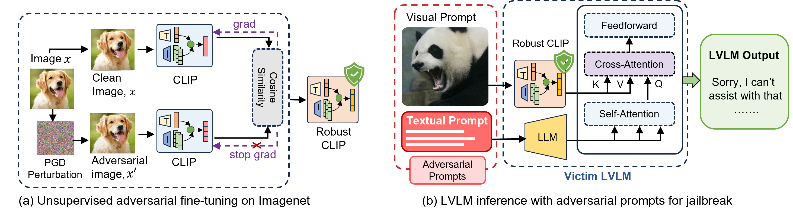

<h1 align="center">Securing Vision-Language Models with a Robust Encoder Against Jailbreak and Adversarial Attacks</h1>

<p align="center">
  <b>Md Zarif Hossain</b> · <b>Ahmed Imteaj</b>
</p>

<p align="center">
<a href="https://arxiv.org/abs/2409.07353"></a>
  
</p>

<hr>


<!--  -->

<p align="justify">Large Vision-Language Models (LVLMs), trained on multimodal big datasets, have significantly advanced AI by excelling in vision-language tasks. However, these models remain vulnerable to adversarial attacks, particularly jailbreak attacks, which bypass safety protocols and cause the model to generate misleading or harmful responses. This vulnerability stems from both the inherent susceptibilities of LLMs and the expanded attack surface introduced by the visual modality. We propose Sim-CLIP+, a novel defense mechanism that adversarially fine-tunes the CLIP vision encoder by leveraging a Siamese architecture. This approach maximizes cosine similarity between perturbed and clean samples, facilitating resilience against adversarial manipulations.
Sim-CLIP+ offers a plug-and-play solution, allowing seamless integration into existing LVLM architectures as a robust vision encoder. Unlike previous defenses, our method requires no structural modifications to the LVLM and incurs minimal computational overhead. Sim-CLIP+ demonstrates effectiveness against both gradient-based adversarial attacks and various jailbreak techniques.
We evaluate Sim-CLIP+ against three distinct jailbreak attack strategies and perform clean evaluations using standard downstream datasets, including COCO for image captioning and OKVQA for visual question answering. Extensive experiments demonstrate that Sim-CLIP+ maintains high clean accuracy while substantially improving robustness against both gradient-based adversarial attacks and jailbreak techniques.</p>

## Contents

- [Overview](#overview)
- [Installation](#installation)
- [Fine-tuning Dataset](#dataset)
- [Adversarial Training](#adversarial-training)
- [Models](#models)
- [Jailbreak Attacks](#jbattacks)
    - [VisualAdv](#visual)
    - [ImgJP](#imgjp)
    - [Hades](#hades)
- [Evaluation](#evaluation)

## Overview


<p align="center">
  
</p>


<p align="justify">Adversarial attacks, particularly jailbreak attacks, pose a significant threat to Large Vision-Language Models (LVLMs) by bypassing safety protocols and prompting harmful or misleading outputs. These vulnerabilities stem from the expanded attack surface introduced by the visual modality and the inherent weaknesses of LLMs. To address this, we propose Sim-CLIP+, a novel defense mechanism that enhances the robustness of the CLIP vision encoder within LVLMs. As illustrated in Figure (a), Sim-CLIP+ utilizes a Siamese architecture to fine-tune the vision encoder by maximizing the cosine similarity between clean and adversarially perturbed images. This process helps the model learn invariant features, strengthening its resistance to adversarial manipulations. Additionally, Figure (b) demonstrates how a robust Sim-CLIP+ encoder effectively blocks jailbreak attempts during LVLM inference, preventing harmful outputs. Sim-CLIP+ is a plug-and-play solution that integrates seamlessly into existing LVLM architectures, requiring no structural modifications and adding minimal computational overhead, making it a powerful tool against adversarial and jailbreak attacks.</p>


## Installation

1. Clone this repository and navigate to the SimCLIP folder:

```
git clone https://github.com/speedlab-git/Robust-Encoder-against-Jailbreak-attack.git
cd Robust-Encoder-against-Jailbreak-attack
```

2. We recommend you to use [Anaconda](https://www.anaconda.com/products/distribution) to maintain installed packages and the environment. We use **Python 3.11** for our training and evaluation. Install required packages using the following commands:

```
conda create -n robustEnocder python=3.11 -y
conda activate robustEnocder
pip install -r requirements.txt
```


### Adversarial training dataset

We adversarially pre-train CLIP on the ImageNet dataset. Please download the ImageNet dataset from [here](https://www.image-net.org/download.php) or use the following command:
If you are using windows, please use `linux subsystem (WSL)`

```
wget https://image-net.org/data/ILSVRC/2012/ILSVRC2012_img_val.tar
wget https://image-net.org/data/ILSVRC/2012/ILSVRC2012_img_train.tar
```

After downloading the ImageNet dataset, extract the training and validation data using the provided script in `bash` folder:

```
./bash/imagenet/extract_ILSVRC.sh
```


## Adversarial training

In this repository, we provide scripts for running adversarial training with our proposed method, `Sim-CLIP+`. We have provided bash scripts for easier execution of this training method. The script is tailored to run Sim-CLIP training with the necessary configurations.

### 1. Sim-CLIP+<sup>4</sup>

```
python -m train.adversarial_training_simclip --clip_model_name ViT-L-14 --pretrained openai --dataset imagenet --imagenet_root /c/CodesSpring24/Data/imagenet-object-localization-challenge/ILSVRC/Data/CLS-LOC --template std --output_normalize False --steps 10000 --warmup 1400 --batch_size 64 --loss l2 --opt adamw --lr 1e-3 --wd 1e-5 --attack pgd --attack_loss l2 --norm linf --eps 4 --iterations_adv 10 --stepsize_adv 1 --wandb True --output_dir "output directory" --experiment_name SimCLIP4 --log_freq 10
```

or execute the bash script(you can specify the training parameters inside). Make sure you are in the `Robust-Encoder-against-Jailbreak-attack` folder

```
./bash/training/simclip_train.sh
```


### **Note:**

- Set `--imagenet_root` with the path of your downloaded ImageNet dataset. Set `eps 2` to obtain Sim-CLIP<sup>2</sup>, FARE<sup>2</sup> and TeCoA<sup>2</sup> models
- We recommend a dual GPU setup with a total of 32 GB VRAM. If you are facing any issues with the GPU running out of memory, please reduce the `batch size`
- Modify the `output_dir` parameter to specify the directory to save the model checkpoints

## Models

| Model Name           | Type   | Proposed By                                                  | Download Link                                                                                               |
| -------------------- | ------ | ------------------------------------------------------------ | ----------------------------------------------------------------------------------------------------------- |
| CLIP                 | Clean  | [OpenAI](https://arxiv.org/pdf/2103.00020)                   | [Load CLIP model](https://huggingface.co/docs/transformers/en/model_doc/clip#transformers.CLIPModel)        |
| Sim-CLIP<sup>4</sup> | Robust | Our Method                                                   | [Download Sim-CLIP<sup>4</sup>](https://huggingface.co/hossainzarif19/SimCLIP/blob/main/simclip4.pt)        |
| Sim-CLIP<sup>2</sup> | Robust | Our Method                                                   | [Download Sim-CLIP<sup>2</sup>](https://huggingface.co/hossainzarif19/SimCLIP/blob/main/simclip2.pt)        |
| FARE<sup>4</sup>     | Robust | [Schlarmann et al. (2024)](https://arxiv.org/pdf/2402.12336) | [Download FARE<sup>4</sup>](https://huggingface.co/collections/chs20/robust-clip-65d913e552eca001fdc41978)  |
| FARE<sup>2</sup>     | Robust | [Schlarmann et al. (2024)](https://arxiv.org/pdf/2402.12336) | [Download FARE<sup>2</sup>](https://huggingface.co/collections/chs20/robust-clip-65d913e552eca001fdc41978)  |

## Usage

To use these models, you can load them using the provided code. For example, to load the Sim-CLIP<sup>4</sup> model, you can use the following code snippet:

```
### Using Sim-CLIP Robust Vision Encoder during Inference

To use the Sim-CLIP robust vision encoder during inference, follow these steps:

1. Open the `builder.py` file located in the `VisualAdv/llava_llama_2/model/` directory.
2. Go to line `132` in the `builder.py` file.
3. Replace the existing path with `Simclip4.pt` vision encoder 
```


## Jailbreak Attacks 

### VisualAdv 

To run VisualAdv, follow these steps:

1. Change directory to VisualAdv:
    ```
    cd VisualAdv
    ```

2. Set up the environment for LLaVA-LLaMA-2 by following the instructions in the original repository: [LLaVA Repository](https://github.com/haotian-liu/LLaVA)

3. After setting up the environment and obtaining the model, save it to the path:
    ```
    ./ckpts/llava_llama_2_13b_chat_freeze
    ```

4. The adversarial image is already provided in the bash prompt with the adversarial prompts.

5. Run the following command to execute the inference:
    ```
    ./bash/llava_inference_robustPrev.sh
    ```


### ImgJP attack

1. Change directory to ImgJP:
    ```
    cd ImgJP
    ```
2. Set up the environment using the provided YAML file:
    ```
    conda env create -f environment.yml
    conda activate jbattack
    ```
3. 

3. For inference, we use LLAVA modules setup in VisualAdv attack. Go to the VisualAdv folder and run:
    ```
    ./bash/llava_inference_ImgJP.sh
    ```


### HADES attack 

### HADES attack 

1. Change directory to HADES:
    ```
    cd HADES
    ```

2. Set up the environment by following the instructions in the original repository: [HADES Repository](https://github.com/RUCAIBox/HADES). Save the VLM trained checkpoints in the `checkpoints` folder

3. After setting up the environment and obtaining the necessary checkpoints, save them to the appropriate paths as specified in the repository.

4. Download the adversarial data from the following [link](https://drive.google.com/drive/folders/1k4coKdLd_iLhwyTyWmz8nQ0thN4D01qc)

5. Run the following command to execute the evaluation:
    ```
    bash run_evaluation.sh abstract llava black_box
    ```


## Acknowledgements

We extend our gratitude to the developers and contributors of the following repositories for their invaluable resources and tools that have significantly aided in the development and evaluation of our project:

- [LLaVA](https://github.com/haotian-liu/LLaVA)
- [VisualAdv](https://github.com/Unispac/Visual-Adversarial-Examples-Jailbreak-Large-Language-Models)
- [HADES](https://github.com/RUCAIBox/HADES)
- [ImgJP](https://github.com/abc03570128/Jailbreaking-Attack-against-Multimodal-Large-Language-Model/tree/main)


